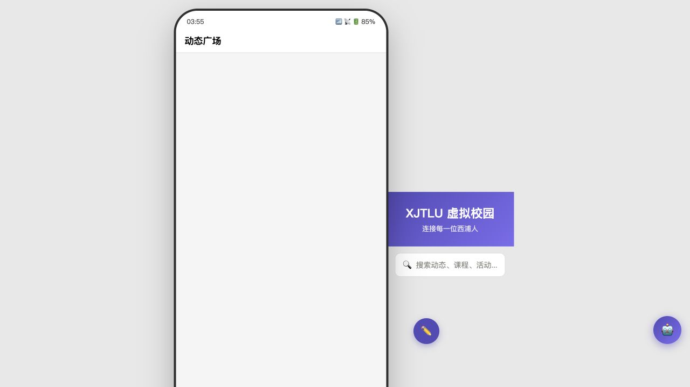

# 旧 Demo 体验基线

> 记录日期：2026-08-01
> 目的：在重建 SURF Campus Shell 前保留可对照的视觉、信息层级和交互证据。

## 截图

桌面视口下的旧 Demo：

## 观察结果

### 信息层级

- 首屏标题是“动态广场”，产品中心偏向社区信息流，而不是问卷和 `PROJECT_PLAN.md` 要求的校园工作台。
- 重要通知、课程 DDL、资料搜索和活动没有出现在同一个任务视图中，用户需要切换底部 Tab 才能继续。
- 首页存在渐变 Banner 和搜索占位，但没有呈现“现在最需要处理的事”或明确的下一步。

### 视觉与布局

- 页面被固定在 390px 手机框内；桌面屏幕只展示一个被放大的模拟手机，无法支持快速扫描和高信息密度任务。
- 使用紫色/蓝色渐变 Banner、emoji 图标和多个漂浮按钮，装饰层级高于任务层级。
- 各模块独立使用临时卡片样式，没有统一的状态色、焦点样式、错误/空数据/加载反馈和可复用操作组件。

### 交互与反馈

- 搜索、发布问题和部分输入依赖 `prompt`/`confirm`，输入上下文脱离页面，键盘和触屏体验不稳定。
- AI 是页面外的悬浮入口，无法自动携带当前资料、问题或通知上下文。
- 主要动作使用 `onclick` 和静态占位提示；成功、失败、加载和返回路径不一致。
- 没有明确的移动端单手操作模型、桌面端应用 Shell、键盘焦点反馈或 `prefers-reduced-motion` 策略。

## 重建判断

新版本采用“任务优先的校园工作台”：桌面侧栏 + 顶部搜索/通知，移动端底部导航，主区域依次呈现重要通知、课程任务、资料、活动和课程问答；AI 作为资料/问题详情旁的上下文操作，不再作为脱离页面的悬浮入口。旧 Demo 只作为问题基线，不作为新视觉与交互实现的组件来源。
